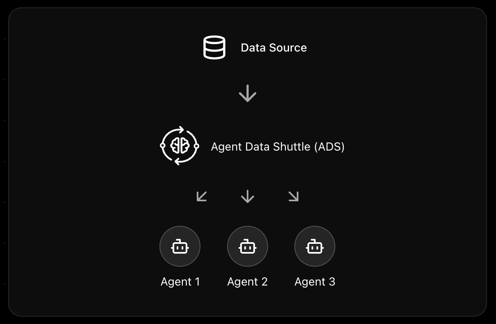

# Agent Data Shuttle (ADS)

  <strong>Open, modular, and language-agnostic data and agent interoperability for "truly autonomous" AI workflows</strong>

**Agent Data Shuttle (ADS)** is an open-source protocol for connecting AI agents to realtime data sources - across languages, runtimes, and platforms.

ADS enables seamless autonomous invocation of your AI agents, allowing them to react to events, monitor systems, and interact with tools in real-time without human intervention.

  

---

## Getting Started

- 📚 **Read the [Documentation](https://agentdatashuttle.knowyours.co/)** for concepts, architecture, and usage guides
- 🚀 **Try the [Quickstart Projects](https://github.com/agentdatashuttle/ads-example-projects)**
- 💻 **Build with our SDKs:**
  - [Python SDK](https://github.com/agentdatashuttle/python-sdk)
  - [TypeScript SDK](https://github.com/agentdatashuttle/typescript-sdk)
- 🧩 **Integrate with [n8n](https://github.com/agentdatashuttle/n8n-nodes) and other workflow tools**

---

## Project Structure (share a ⭐!)

| Repository                                                                         | Description                                                              |
| ---------------------------------------------------------------------------------- | ------------------------------------------------------------------------ |
| [`ads-bridge`](https://github.com/agentdatashuttle/ads-bridge)                     | Core bridge server to communicate between ADS Publisher and Subscribers  |
| [`ads-documentation`](https://github.com/agentdatashuttle/ads-documentation)       | Docs, concepts, and architecture                                         |
| [`ads-example-projects`](https://github.com/agentdatashuttle/ads-example-projects) | Example projects and quickstarts                                         |
| [`n8n-nodes`](https://github.com/agentdatashuttle/n8n-nodes)                       | n8n integration nodes for ADS                                            |
| [`python-sdk`](https://github.com/agentdatashuttle/python-sdk)                     | Python SDK for ADS                                                       |
| [`typescript-sdk`](https://github.com/agentdatashuttle/typescript-sdk)             | TypeScript SDK for ADS                                                   |

---

## Contributing

We welcome issues, pull requests, and design discussions. **If you’d like to add support for another language, tool, or framework, open a discussion first so we can align on the design!**

---

Agent Data Shuttle is released under the **Apache-2.0** license and maintained by a growing community of AI and data workflow enthusiasts. If your organization needs robust, direct, and secure agent-to-tool communication, or you want to avoid writing wrappers, we’d love to have you involved!

---

## 🚦 ADS vs MCP — Why ADS?

### The Core Philosophy

**MCP:** Model Context Protocol (MCP) uses a “pull” approach - data is fetched when explicitly requested. This is perfect for conversational scenarios and on-demand information retrieval.

**ADS:** Agent Data Shuttle (ADS) uses a “push” approach - data flows automatically when events occur. This enables real-time updates, reactive agent invocation, and truly autonomous AI behavior, empowering agents to act without human prompting.

---

### Key Differences

|               | **MCP** (Pull)          | **ADS** (Push)          |
| ------------- | ----------------------- | ----------------------- |
| **Data Flow** | Pull-based (Manual)     | Push-based (Automatic)  |
| **Trigger**   | User/Agent Query        | Event Occurrence        |
| **Use Case**  | On-demand agentic flows | Real-time agentic flows |
| **Latency**   | Query time              | Near real-time          |

---

### When to Use What?

**Choose MCP when:**

- You need on-demand agent invocation
- Your AI agent needs to answer specific questions
- Query-response is your primary interaction model

**Choose ADS when:**

- You need real-time agent invocations based on external events
- Your AI agent needs to stay current with system events
- Proactive monitoring and response is crucial - true “autopilot” mode

---

### Better Together

> 💡 **MCP × ADS is better than either alone.**
>
> - Use MCP for your agent’s active inquiries and deep dives.
> - Use ADS for keeping your agent autonomously aware and responsive.
>
> Combine both for an AI that can both investigate (MCP) and independently react (ADS).
